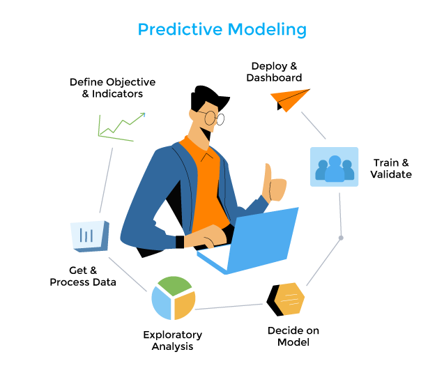

# Welcome to Predictive Analytics



Predictive modeling is creating a mathematical model to accurately predict future events based on previous or historical data. This course utilizes and hopes to achieve and understanding on both mathematical and technical concepts behind the algorithms used to make predictions.

## Table of Contents

- [Welcome to Predictive Analytics](#welcome-to-predictive-analytics)
  - [Table of Contents](#table-of-contents)
  - [Tools and Knowledge](#tools-and-knowledge)
    - [Statistics](#statistics)
    - [Machine Learning](#machine-learning)
    - [Git](#git)
    - [Code Sharing Platforms (GitHub)](#code-sharing-platforms-github)
    - [Development Tools (IDEs)](#development-tools-ides)
    - [Jupyter Notebooks & Lab](#jupyter-notebooks--lab)
    - [Google Colab](#google-colab)
    - [Python](#python)
    - [Numpy, Pandas](#numpy-pandas)
    - [Visualizations](#visualizations)
  - [Todo List](#todo-list)
  - [References](#references)
  - [Conclusion](#conclusion)

## Tools and Knowledge

Things you will need to get yourself familiar with. Following is the stuff you need to be prepared for to fully cooperate on this class.

### Statistics

Statistics is the science of collecting data and analyzing them to infer proportions (sample) that are representative of the population. In other words, statistics is interpreting data in order to make predictions for the population.

[Two main statistical methods](https://statistics.laerd.com/statistical-guides/descriptive-inferential-statistics.php) are used in data analysis: 

[Descriptive statistics](https://en.wikipedia.org/wiki/Descriptive_statistics), which summarize data from a sample using indexes such as the mean or standard deviation. Descriptive statistics are most often concerned with two sets of properties of a distribution (sample or population): central tendency (or location) seeks to characterize the distribution's central or typical value, while dispersion (or variability) characterizes the extent to which members of the distribution depart from its center and each other. 

[Inferential statistics](https://en.wikipedia.org/wiki/Statistical_inference), which draw conclusions from data that are subject to random variation (e.g., observational errors, sampling variation). Inferences on mathematical statistics are made under the framework of probability theory, which deals with the analysis of random phenomena.

### Machine Learning

Arthur Samuel coined the term `Machine Learning` [in 1959 with the definition](https://ieeexplore.ieee.org/abstract/document/5392560):

> Computers the ability to learn without being explicitly programmed. ~ Arthur Samuel

As said, nowadays the definition hasn't changed much. It is the study of computer science algorithms that can improve automatically through experience and by the use of data. Machine learning algorithms are used in a wide variety of applications, such as in medicine, email filtering, speech recognition, and computer vision, where it is difficult or unfeasible to develop conventional algorithms to perform the needed tasks.

### Git

<!-- The version control system -->

The assignments are stored and shared using [GitHub](https://github.com/) and we use [Git](https://git-scm.com/) to be able to version and interact with our repositories.

**Make sure** to install Git on your local computer.

My recommendation is go over the following stuff.

- Your first steps towards Git, [Learn to use Git](https://guides.github.com/activities/hello-world/)
- Learn GitHub and Git using GitHub Lab, [Github Lab](https://lab.github.com/)
- Useful to understand how Git works, [Git Cheat Sheet](https://education.github.com/git-cheat-sheet-education.pdf)
- Useful to understand how GitHub works, [Github Flow](https://enterprise.github.com/downloads/en/-github-flow-cheatsheet.pdf)
- Useful for your README.md files, [Github Flawored Markdown Cheat Sheet](https://enterprise.github.com/downloads/en/markdown-cheatsheet.pdf)
- Protips from Data Scientist at GitHub, [Tips, tricks, hacks, and secrets from Alyson La](https://github.blog/2020-04-23-github-protips-tips-tricks-hacks-and-secrets-from-alyson-la/)
- A simple git learning experience with a desktop app, [Git-it (Desktop App)](https://github.com/jlord/git-it-electron)
- A set of tutorials, [Get Git Right by Atlassian](https://www.atlassian.com/git)
- Overwhelmed by git command line, what about an app? [Sourcetree](https://www.sourcetreeapp.com/)

### Code Sharing Platforms (GitHub)

<!-- GitHub in brief -->

[GitHub](https://github.com/) is how people build software. It has over 100 million repositories hosted in its platform as of August 2019, and its an essential tool for collaboration and sharing.

**Make sure** to create a GitHub account. Go to [https://github.com/join](https://github.com/join).

- [Introduction to GitHub, by GitHub](https://lab.github.com/githubtraining/introduction-to-github)
- [An Introduction to GitHub by US Government!](https://digital.gov/resources/an-introduction-github/)
- [A Dead Simple Intro to GitHub for the Non-Technical](https://medium.com/crowdbotics/a-dead-simple-intro-to-github-for-the-non-technical-f9d56410a856)
  
### Development Tools (IDEs)

<!-- VSCode and advantages -->

My favorite, bittersweet tool, [Visual Studio Code](https://code.visualstudio.com/), use it and you'll love it!

**Make sure** to install VS Code to your computer. Add the following extensions as well.
  - [Pylance](https://marketplace.visualstudio.com/items?itemName=ms-python.vscode-pylance) a new language server from Microsoft.
  - [Python](https://marketplace.visualstudio.com/items?itemName=ms-python.python) to enable intellisense, environment management, etc.
  - [Markdown PDF](https://marketplace.visualstudio.com/items?itemName=yzane.markdown-pdf) for getting used to Markdown syntax.
  - [Live Code](https://marketplace.visualstudio.com/items?itemName=MS-vsliveshare.vsliveshare) to interact with each other.

Even tough are a lot of online resoources available to make the most out of VSCode, recently Microsoft introduced a new set of articles to [learn to code with Visual Studio Code](https://code.visualstudio.com/learn). **Utilize this** to get yourself familiar with VS Code and understand why tools like VS Code are much better than just a text editor.

There are alternatives of course, you are welcome to use those as well. The point is an IDE will make your life much easier if you choose to use one!

Alternatives

- [Atom](https://atom.io/)
- [Notepad++](https://notepad-plus-plus.org/) (I use it as an advanced Notepad, rather than an IDE) 
- [Sublime](https://www.sublimetext.com/)
- And many, many more over [here](https://www.google.com/search?q=integrated+development+editor).

Development tools from your browser!

- [Your instant dev environment in GitHub](https://github.com/features/codespaces)
- [An instant IDE and prototyping tool for rapid web development.](https://codesandbox.io/)

### Jupyter Notebooks & Lab

<!-- Interactive local development with Jupyter Notebooks. -->

Another code editor you can use is [Jupyter Notebooks](https://jupyter.org/). The Jupyter Notebook is an open-source web application that allows you to create and share documents that contain live code, equations, visualizations and narrative text. Uses include: data cleaning and transformation, numerical simulation, statistical modeling, data visualization, machine learning, and much more.

**Make sure** jupyter is installed on your computer and in your PATH. 

To start jupyter you will type in terminal.

``` sh
jupyter notebook
```

### Google Colab

Colaboratory is built on top of Jupyter Notebook. 

- [basic_features_overview.ipynb](https://colab.research.google.com/notebooks/basic_features_overview.ipynb)
- [welcome.ipynb](https://colab.research.google.com/notebooks/welcome.ipynb)

### Python

[Python](https://www.python.org/) is a programming language that lets you work quickly and integrate systems more effectively. It is developing to adjust latest changes and constantly growing by the powerful community that supports it. Using [PyPI](https://pypi.org/), any developer can publish and distribute python packages.

``` py
# Python 3: Fibonacci series up to n
def fib(n):
    a, b = 0, 1
    while a < n:
        print(a, end=' ')
        a, b = b, a+b
    print()
fib(1000)
0 1 1 2 3 5 8 13 21 34 55 89 144 233 377 610 987
```

In this course, we use Python. You can use either [standard python](https://www.python.org/), or [anaconda distribution](https://www.anaconda.com/distribution/), up to your preference. 

**Make sure** python is installed and in your PATH.

It is better to know Python syntax, even tough we will be covering it in the class.

- Learn the syntax, [W3Schools Python Tutorial](https://www.w3schools.com/python/default.asp)
- Online Tool to Learn Python, [learnpython.org](https://www.learnpython.org/)
- A rather broader place to learn Python, [Geek for Geeks](https://www.geeksforgeeks.org/python-programming-language/)

### Numpy, Pandas

Both of these packages are tools for computing and data analysis with python. 

[Numpy](https://numpy.org/) is a N-dimensional array object with lots of functionalites that base itself from linear algebra. Numpy arrays essentially come in two flavors: Vectors and Matrics. Vectors are strictly 1-d array whereas Matrices are 2-d but matrices can have only one row/column.

``` py
import numpy as np
np.array([1, 2, 3])         # Create a rank 1 array
np.arange(15)               # generate an 1-d array from 0 to 14
np.arange(15).reshape(3, 5) # generate array and change dimensions
```

[Pandas](https://pandas.pydata.org/) is a fast, powerful, flexible and easy to use open source data analysis and manipulation tool, built on top of the Python programming language.

Pandas provides for many different kinds of data: tabular data, time-series data, arbitrary matrix data with row and column labels, and Any other form of observational/statistical data sets.

``` py
import numpy as np          #importing numpy
import pandas as pd         #importing pandas
arr=np.array([1,3,5,7,9])   #create arr array
s2=pd.Series(arr)           #create pandas series s2
```

Follow this [amazing introductory tutorial ](https://towardsdatascience.com/top-python-libraries-numpy-pandas-8299b567d955)on numpy and pandas modules.

**Make sure** both of these libraries installed on your site packages.

### Visualizations

Data visualization gives crutial understanding of machine learning models and to understand our data well. There are many great packages that can help you with visualization.

- matplotlib
- seaborn
- plotly
- bokeh

And many many more for [scientific visualization in PyPI](https://pypi.org/search/?q=&o=-created&c=Topic+%3A%3A+Scientific%2FEngineering+%3A%3A+Visualization).

## Todo List

<!-- A list of items for student to follow -->

You may receive assignments that uses GitHub's autograding feature using unit testing. This is done through [GitHub Actions](https://docs.github.com/en/actions) and writing [unit tests](https://realpython.com/python-testing/). To get use to how this works, we will make a practice run.

1. Make a python file with name `my_code.py`.
2. Create at least 2 functions for practice.
3. Check out [test_my_code.py](test_my_code.py) file. This file will test your code once you upload to GitHub!
4. Upload to GitHub once you are done.
5. Go to your repository and check `Actions` tab. After every commit you make, GitHub runs `test_my_code.py` file to validate if your code is satisfactory. See example of an output in my [assignment-0-metinsenturk/actions](https://github.com/spu-bigdataanalytics-212/assignment-0-metinsenturk/actions).
6. Click the green button at the top of the repo, and do `Download ZIP`.
7. As a practice, **download your repository** and **upload it to blackboard** as your first assignment!
8. That's it.

## References

- [Applied Predictive Modeling](http://appliedpredictivemodeling.com/) is a book on the practice of modeling when accuracy is the primary goal written by Max Kuhn, Kjell Johnson
- [Descriptive Statistics](https://towardsdatascience.com/descriptive-statistics-f2beeaf7a8df)
- IBM and Epic Apply Predictive Analytics to Electronic Health Records, by Zina
Moukheiber, Forbes magazine, February 19, 2014.
- How Dell Predicts Which Customers Are Most Likely to Buy, by Rachael King, CIO Journal, Wall Street Journal, December 5, 2012.

## Conclusion

<!-- The takeaway of this repository and whats next. -->

That's it! To a wonderful semester, 

Happy coding!
